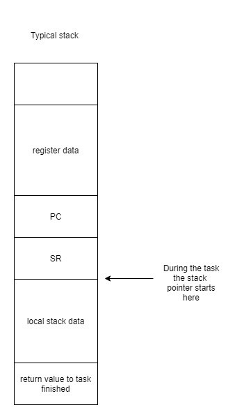

# BayertRTOS
This is a simple realtime operating system for the MSP430 microcontroller. 

## System Features
 * Preemptive operating system
 * Ability to create tasks on the fly.
 * All register data is saved and restored between tasks.
 * Seperate stacks for each task.
 * Memory management

## Getting Started
 Import the lib files into your project.

## System Setup

Each task gets its own stack to use. Once a task time is up, the system will interrupt the task. The system will save the stack pointer and program counter, along with all the other registers. These values are saved onto the task’s stacks when other tasks are running. A typical stack for a task will look like this:

